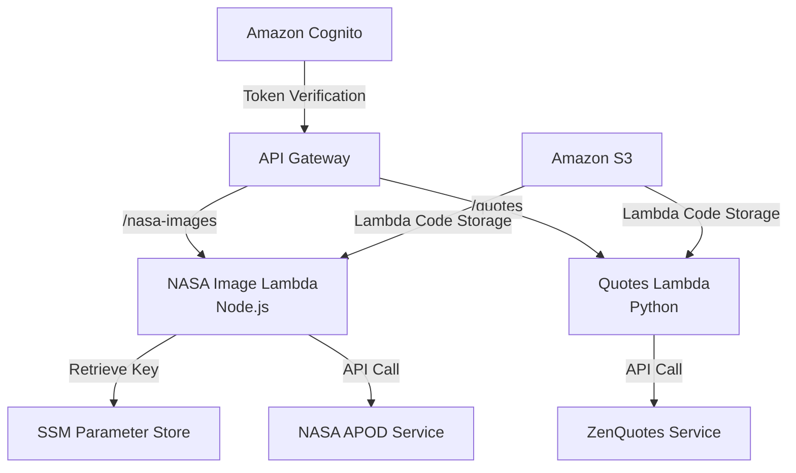

# AWS API Gateway with Cognito Authentication

This project provisions a protected API service using AWS CloudFormation. It creates two endpoints when deployed successfully:

| API | Description |
|---------|-------------|
| /quotes | Get random inspirational quotes |
| /nasa-images | Get the daily astronomy image and its metadata |

To make the API service meaningful, you can build a client application like "Daily Inspiration" that provides daily motivation through a combination of visuals and text. For example, the application sends subscribed users each day a quote on the image through email, mobile notifications, or a web page.

For a quick start, please try out the demo endpoints:

```sh
# /quotes
curl -X GET "https://jdoc6ke3gh.execute-api.ca-central-1.amazonaws.com/prod/quotes" -H "Authorization: Bearer <IdToken>"

# /nasa-images
curl -X GET "https://jdoc6ke3gh.execute-api.ca-central-1.amazonaws.com/prod/nasa-images" -H "Authorization: Bearer <IdToken>"
```

**Note**: Read this [section](#creating-and-authenticating-users) for more details on how to retrieve an authentication token. _Use `virqpnb2g6jvtjqi21c33i0vb` for the `UserPoolClientId`._

<details>
<summary>Table of Contents</summary>

1. [AWS API Gateway with Cognito Authentication](#aws-api-gateway-with-cognito-authentication)
2. [Architecture Overview](#architecture-overview)
3. [External Services](#external-services)
4. [Prerequisites](#prerequisites)
5. [Deploying AWS CloudFormation](#deploying-aws-cloudformation)
6. [Creating and Authenticating Users](#creating-and-authenticating-users)
7. [Testing API Endpoints](#testing-api-endpoints)
8. [Constraints](#constraints)
9. [Production Enhancements](#production-enhancements)

</details>

## Prerequisites
- AWS CLI should be installed and configured with a profile that has the following permissions:
  - CloudFormation: Full access to create and manage stacks
  - IAM: Permissions to create roles and policies
  - S3: Create and manage buckets, upload objects
  - Lambda: Create and manage functions
  - API Gateway: Create and manage APIs
  - Cognito: Create user pools and manage users
  - SSM: Put and retrieve parameters (for storing the NASA API key)
- `npm` should be installed to package the `Node.js` lambda function
- A NASA API key should be available in SSM Parameter Store. To push your key to the store, please run:
    ```sh
    aws ssm put-parameter --name "/api-keys/nasa" --type "SecureString" --value "YOUR_NASA_API_KEY" --description "NASA API Key"
    ```
    Note: you can get the NASA API key from this [website](https://api.nasa.gov/).

## Architecture Overview


| Service | Description |
|---------|---------|
| Amazon Cognito | Provides authentication layer |
| API Gateway | Serves as the entry point for lambda functions |
| Amazon S3 | Stores Lambda deployment packages |
| SSM Parameter Store | Provides secure store for NASA API key |
| NASA Image Lambda (Node.js) | Get the daily image from NASA APOD service |
| Quotes Lambda (Python) | Get random quote from ZenQuotes service |

## External Services
There are two external services the project uses:

| Service | Description | API Key Required | Website |
|---------|-------------|------------------|--------------|
| NASA APIs | Get the daily astronomy image and its metadata | Yes | https://api.nasa.gov/ |
| ZenQuotes | Get random inspirational quotes | No | https://zenquotes.io/ |

## Deploying AWS CloudFormation

Run the deployment script:
```sh
chmod +x deploy_lambda_code.sh
./deploy_lambda_code.sh
```

This script packages lambda functions defined in `/lambdas` and upload them to the S3 bucket. If it doesn't exist, it auto-creates one for you:

```json
{
  "name": "api-gateway-assessment-lambda-code",
  "region": "ca-central-1",
}
```

You can verify if Lambda packages have been successfully uploaded:
```sh
aws s3 ls s3://api-gateway-assessment-lambda-code/
```

Deploy the CloudFormation template file:
```sh
aws cloudformation deploy --template-file cloudformation/main.yaml --stack-name "api-gateway-assessment-stack" --capabilities CAPABILITY_IAM --region ca-central-1
```

This provisions a CloudFormation stack named `api-gateway-assessment-stack` in `ca-central-1` region.

Lastly, retrieve information about the deployed CloudFormation stack:

```sh
aws cloudformation describe-stacks --stack-name "api-gateway-assessment-stack" --query "Stacks[0].Outputs"
```

Please take note of the `ApiGatewayUrl`, `UserPoolClientId`, and `UserPoolId` from the response. We will need them in the next section.

## Creating and Authenticating Users
Create a new user:
```sh
aws cognito-idp sign-up --client-id "<UserPoolClientId>" --username "testuser" --password "tempPassword@1234"
```

Confirm the user:
```sh
aws cognito-idp admin-confirm-sign-up --user-pool-id "<UserPoolId>" --username "testuser"
```

Lastly, authenticate the user:
```sh
aws cognito-idp initiate-auth --client-id "<UserPoolClientId>" --auth-flow "USER_PASSWORD_AUTH" --auth-parameters "USERNAME=testuser,PASSWORD=tempPassword@1234"
```

Please take note of the `IdToken` from the response. We will need it in the next section.

## Testing API Endpoints
Try out the `/nasa-images`:

  ```sh
  curl -X GET https://<ApiGatewayUrl>/prod/nasa-images -H "Authorization: Bearer <IdToken>"
  ```

Expected sample response:

  ```json
  {
    "title": "Blue Ghost's Diamond Ring",
    "url": "https://apod.nasa.gov/apod/image/2503/eclipse-shot-from-blue-ghost-crop1024.jpg",
    "explanation": "On March 14 the Full Moon slid through Earth's dark umbral shadow and denizens of planet Earth were treated to a total lunar eclipse. Of course, from the Moon's near side that same astronomical syzygy was seen as a solar eclipse. Operating in the Mare Crisium on the lunar surface, the Blue Ghost lander captured this video frame of Earth in silhouette around 3:30am CDT, just as the Sun was emerging from behind the terrestrial disk. From Blue Ghost's lunar perspective the beautiful diamond ring effect, familiar to earthbound solar eclipse watchers, is striking. Since Earth appears about four times the apparent size of the Sun from the lunar surface the inner solar corona, the atmosphere of the Sun most easily seen from Earth during a total solar eclipse, is hidden from view. Still, scattering in Earth's dense atmosphere creates the glowing band of sunlight embracing our fair planet.",
    "date": "2025-03-19",
    "mediaType": "image"
}
  ```

Try out the `/quotes`:

  ```sh
  curl -X GET https://<ApiGatewayUrl>/prod/quotes -H "Authorization: Bearer <IdToken>"
  ```

Expected sample response:

  ```json
  {
    "quote": "One of the keys to happiness is a bad memory.",
    "author": "Rita Mae Brown",
    "source": "ZenQuotes.io"
  }
  ```

## Constraints
- **Dependency**: As it was mentioned above, this project has a dependency on external services (`ZenQuotes`, and `NASA APOD`) which has its own rate limits. So be mindful of making excessive requests. Additionally, because of its dependency, it may cause breaking changes if they change their response formats.

- **Versioning**: Currently, the CloudFormation template doesn't have verioning strategies and overwrites Lambda function packages, making it difficult to track changes.

## Production Enhancements
- **Custom Domain**: Set up a custom domain in the API Gateway instead of using the AWS-generated domain.
- **Rate Limiting**: Throttle requests and protect the service from excessive requests. Otherwise, it could impact its performance and lead to higher AWS charges.
- **Security**: Limit which websites can access the service to enhance security. You can configure CORS settings to be more restrictive.
- **Caching**: The API Gateway offers caching which can improve performance by reducing the number of external calls made in Lambda functions.
